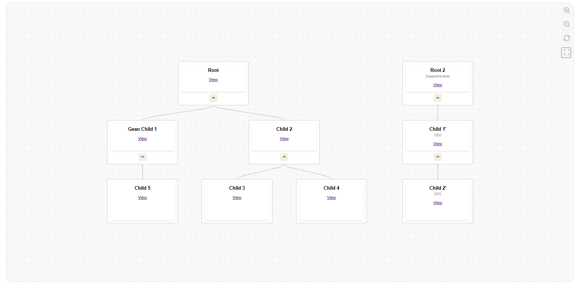

# SVGTreeViewer

A lightweight, customizable tree visualization library for the web. SVGTreeViewer renders hierarchical data in an interactive SVG canvas with panning, zooming, collapsing/expanding, and node dragging capabilities.



## Features

- **Interactive Tree Visualization**: Display hierarchical data in a tree structure
- **Multiple Root Nodes**: Support for forests (multiple root nodes)
- **Pan & Zoom**: Smooth panning and zooming of the canvas
- **Node Manipulation**: Drag & drop nodes to customize your tree layout
- **Collapsible Nodes**: Expand/collapse nodes with children
- **Customizable Appearance**: Easily style nodes with custom templates
- **Background Patterns**: Built-in dot and grid patterns for the canvas
- **Interactive Controls**: Zoom, reset, and center buttons
- **Modern S-curved Connectors**: Beautiful connections between nodes

## Installation

### NPM
```bash
npm install svg-tree-viewer
```

### CDN
```html
<script src="https://cdn.jsdelivr.net/npm/svg-tree-viewer@latest/dist/browser/bundle.js"></script>
```

### Self-hosted
Download the latest release from the GitHub repository and include it in your project:
```html
<script src="dist/browser/bundle.js"></script>
```

## Basic Usage

```html
<!DOCTYPE html>
<html lang="en">
<head>
    <meta charset="UTF-8">
    <meta name="viewport" content="width=device-width, initial-scale=1.0">
    <title>SVG Tree Viewer Demo</title>
    <style>
        #tree-container {
            width: 80%;
            height: 80%;
            border-radius: 20px;
            border: 1px solid grey;
            overflow: hidden;
            box-shadow: inset 0 2px 6px rgba(0, 0, 0, 0.15);
            position: relative;
            margin: 50px auto;
        }
    </style>
</head>
<body>
    <div id="tree-container"></div>
    
    <script src="dist/browser/bundle.js"></script>
    <script>
        // Sample data
        const treeData = [
            { id: 1, parent_id: null, text: "Root Node" },
            { id: 2, parent_id: 1, text: "Child 1" },
            { id: 3, parent_id: 1, text: "Child 2" },
            { id: 4, parent_id: 2, text: "Grandchild 1" },
            { id: 5, parent_id: 2, text: "Grandchild 2" },
            { id: 6, parent_id: null, text: "Another Root" }
        ];
        
        // Initialize the tree viewer
        document.addEventListener('DOMContentLoaded', function() {
            const treeViewer = new SVGTreeViewer({
                containerId: 'tree-container',
                data: treeData,
                collapseChild: true
            });
        });
    </script>
</body>
</html>
```

## API Reference

### Options

| Option | Type | Default | Description |
|--------|------|---------|-------------|
| `containerId` | string | (required) | ID of the container element |
| `data` | Array | `[]` | Array of tree node data objects |
| `idAlias` | string | `"id"` | Property name to use as node ID |
| `parentIdAlias` | string | `"parent_id"` | Property name to use as parent ID |
| `collapseChild` | boolean | `false` | Whether to show collapse/expand buttons |
| `template` | string | `"<div class='node'>[data:text]</div>"` | HTML template for node content |
| `nodeWidth` | number | `160` | Width of each node in pixels |
| `nodeHeight` | number | `100` | Height of each node in pixels |
| `nodePadding` | number | `40` | Padding between sibling nodes |
| `levelHeight` | number | `150` | Vertical spacing between tree levels |
| `horizontalSpacing` | number | `200` | Horizontal spacing between nodes |
| `backgroundPattern` | string | `"dots"` | Background pattern (`"dots"`, `"grid"`, or `"none"`) |
| `backgroundColor` | string | `"#f9f9f9"` | Background color |
| `patternColor` | string | `"#cccccc"` | Color of the background pattern |

### Data Format

SVGTreeViewer uses a flat array of objects with parent-child relationships:

```javascript
[
  { id: 1, parent_id: null, text: "Root Node" },
  { id: 2, parent_id: 1, text: "Child Node" }
]
```

Each object can contain any additional properties that can be referenced in the node template using `[data:propertyName]`.

### Methods

| Method | Description |
|--------|-------------|
| `updateData(data)` | Update the tree with new data |
| `resetView()` | Reset the view to initial state |
| `resetNodePositions()` | Reset all nodes to their calculated positions |
| `toggleNodeCollapse(id)` | Expand or collapse a specific node by ID |
| `centerTree()` | Center the tree in the viewport |
| `zoomToFit()` | Zoom to fit all nodes in the view |

## Advanced Usage

### Custom Node Templates

Customize the appearance of nodes using HTML templates:

```javascript
const treeViewer = new SVGTreeViewer({
    containerId: 'tree-container',
    data: treeData,
    template: `
        <div style="text-align:center">
            <strong>[data:text]</strong><br>
            <small>ID: [data:id]</small>
        </div>
    `
});
```

### Custom Background Patterns

Choose from different background patterns:

```javascript
const treeViewer = new SVGTreeViewer({
    containerId: 'tree-container',
    data: treeData,
    backgroundPattern: 'grid',       // 'dots', 'grid', or 'none'
    backgroundColor: '#f0f0f0',
    patternColor: '#dddddd'
});
```

## Events

SVGTreeViewer provides various mouse interactions:
- **Pan**: Click and drag on the canvas
- **Zoom**: Scroll wheel on the canvas
- **Drag Nodes**: Click and drag on a node
- **Collapse/Expand**: Double-click on a node with children or use the collapse/expand button

## Browser Support

SVGTreeViewer works in all modern browsers that support SVG and ES6:
- Chrome (latest)
- Firefox (latest)
- Safari (latest)
- Edge (latest)

## License

MIT License

## Contributing

Contributions are welcome! Please feel free to submit a Pull Request.

1. Fork the repository
2. Create your feature branch (`git checkout -b feature/amazing-feature`)
3. Commit your changes (`git commit -m 'Add some amazing feature'`)
4. Push to the branch (`git push origin feature/amazing-feature`)
5. Open a Pull Request

## Acknowledgments

- Inspired by various tree visualization libraries
- SVG manipulation based on modern web standards